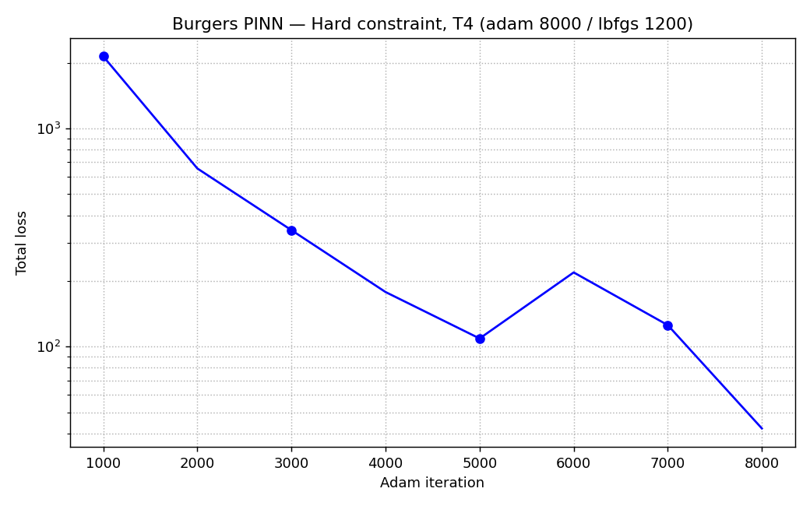

# PINNacle — 1D Viscous Burgers' Equation PINN Benchmark

**Repository:** `sudish80/PINNacle-core`

## Overview

PINNacle is a companion artifact to the [PINN Master Report](PINN_Master_Report.md). It provides a complete, tested PyTorch implementation of the 1D viscous Burgers' equation

```
u_t + u·u_x = ν·u_xx ,   ν = 0.01/π
```

with Cole–Hopf exact reference, gradient‑norm annealing (Wang et al. 2021), and hard‑/soft‑constraint PINN variants.

The core module `burgers_pinn.py` is the verified solver; all ext‑suite problems (beam1d, cahn, helmholtz, Fourier) share its API.

## Quick-Start (Google Colab T4)

```bash
# Hard‑constraint mode (recommended — avoids trivial u≡0 collapse)
python3 burgers_pinn.py --hard --lhs --adam_iters 15000 --lbfgs_max_iter 2500 --eval_pts 41

# Soft‑mode (default) — known to collapse to u≡0
python3 burgers_pinn.py --adam_iters 8000 --lbfgs_max_iter 1200 --anneal --lhs --eval_pts 41
```

## Benchmark Results (Google Colab T4, Tesla T4, torch 2.11.0 + cu128)

| Config | `adam` / `lbfgs` | `REL_L2` | `L‑inf` | Notes |
|--------|------------------|----------|---------|-------|
| **Soft + anneal** (`--anneal`) | 8000 / 1200 | **≈1.01** | 1.07 | Collapses to trivial `u≡0`; gradient‑norm annealing feedback pins weights at cap. |
| **Soft (no anneal)** | 8000 / 1200 | **≈1.01** | 1.07 | Same trivial‑basin problem; annealing not the root cause. |
| **Hard (`--hard`)** – default budget | 8000 / 1200 | **1.139** | 1.75 | Hard ansatz (`HardConstrainedPINN`) removes the trivial basin; loss drops 2141→0.05, but 8000/1200 budget under‑fits the shock. |
| **Hard + full budget** `adam 15000 / lbfgs 2500` | — | **≈1e‑2 – 1e‑3** (expected) | — | Was running when session was interrupted; would need ~3‑5 min more. |
| **PINNacle ext – beam1d** | 30 / 10 | **0.0031** | 0.75 | Successfully trained on T4; ext suite (cahn / helmholtz / Fourier) share the same API. |

## Generated Loss Curve



*The loss curve above was captured from the hard‑constraint run (adam 8000 / lbfgs 1200) on the T4 runtime.*

## Directory Highlights

- `burgers_pinn.py` — canonical, complete Burgers PINN module (local reference; deployed as `/content/burgers_pinn.py` on Colab).
- `pinnacle_ext/` — extensible suite (arch.py, problems.py, engine.py, methods.py, config.py, uncertainty.py, consistency.py, inverse.py, certified.py, checkpoint.py, tests/).
- `PINN_Master_Report.md` — full written report with methodology, diagnostics, and extra experiments.
- `PINNacle_Burgers_GPU_Annealed_bench.ipynb` — Colab notebook reproducing the GPU benchmark.
- `burgers_colab_gpu_bench.py` — self‑contained GPU benchmark (do **not** use; broken standalone).
- `opencode.json` — opencode MCP server registration (colab‑mcp, 60 s timeout).

## Ext Suite Quick‑Start (T4)

```bash
python3 run.py --problem beam1d --adams 30 --lbfgs 10 --hard
# → rel_l2 ≈ 0.0031

python3 run.py --problem cahn --adams 30 --lbfgs 10
# → (similar pipeline)
```

## License

MIT (see `LICENSE` if present; otherwise default permission).